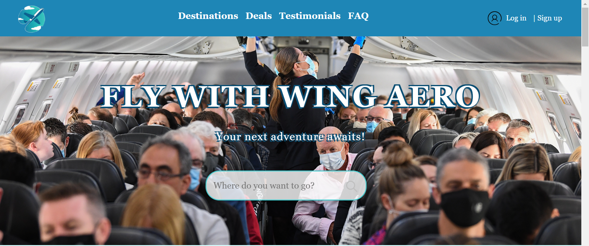
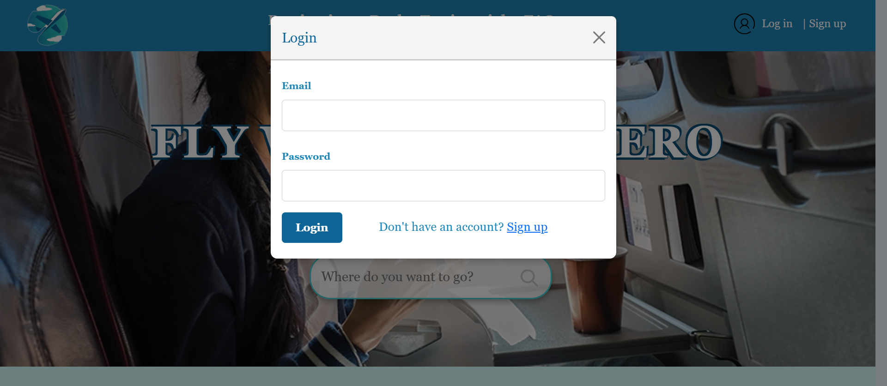
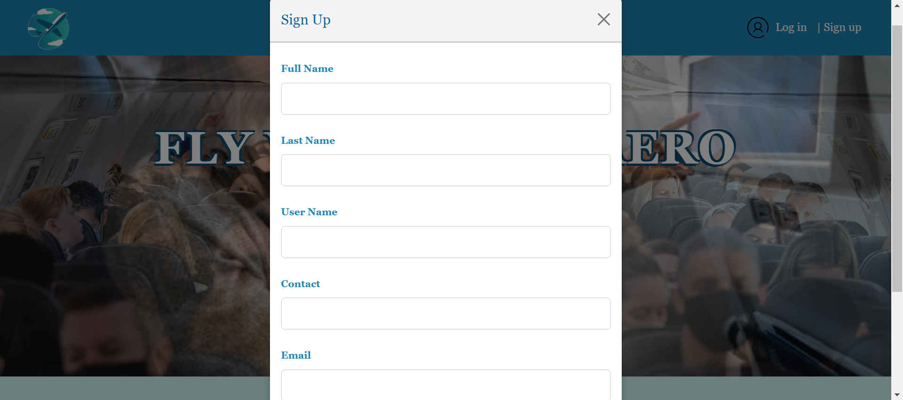
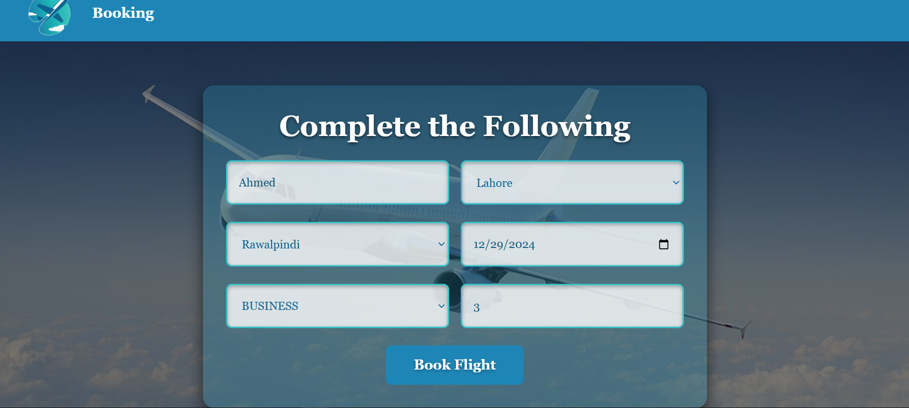
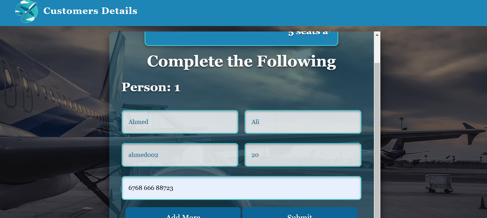
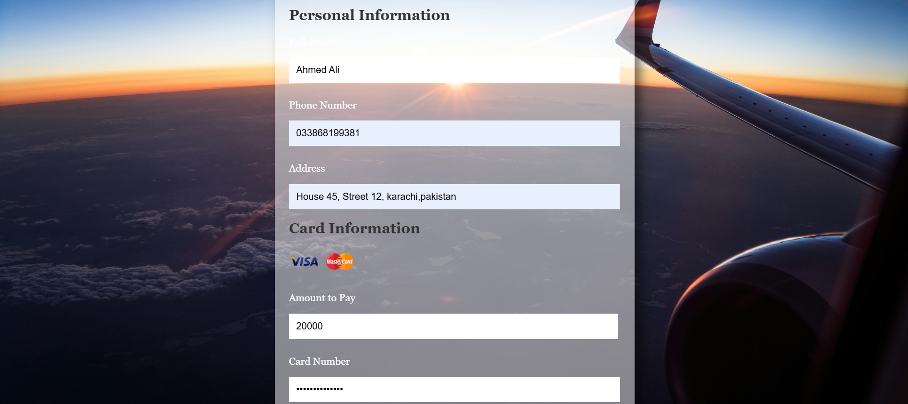

# Flight Booking System
   
## Overview
The Flight Booking System is a web application designed to streamline the flight booking process. It ensures user authentication, facilitates flight searches, and handles customer and payment details efficiently. All data is securely stored in a Microsoft SQL Server database.

---

## Features

### 1. User Authentication
# Login:
 
# Signup: 
 
#### Sign Up & Log In:

- Users **must sign up** before logging in.
- During **sign-up**, the following information is required:
  - First Name
  - Last Name
  - Username
  - Contact
  - Email
  - Password
- The system stores sign-up data securely in the `users` table of the `Flight_Booking_System` database.
- **Mandatory login:** Users must log in with the same email and password they used during sign-up.
- If a user tries to access features (e.g., searching for flights or booking) without logging in, a **popup** will prompt them to log in or sign up.

### 2. Flight Search
   

#### Search Flights:
- Users can search for flights by entering the city name in the search box.
- **City available:** The user will be redirected to the booking page.
- **City unavailable:** A notification popup will inform the user that no flights are available for the selected city.

### 3. Flight Booking
   
#### Booking Form:
- After logging in and selecting a city, users can access the booking form.
- **Form fields include:**
  - Username (auto-filled)
  - Source city
  - Destination city
  - Travel date
  - Class (Economy, Business, etc.)
  - Number of passengers
- Users must complete a **CAPTCHA** before submitting the form.
- Booking details are stored in the `BookingDetails` table of the `Flight_Booking_System` database.

### 4. Customer Details
   
#### Customer Details Form:
- After booking a flight, users are redirected to a **Customer Details** page.
- **Form fields include:**
  - First Name
  - Last Name
  - Username (auto-filled)
  - Age
  - Passport Number
- Users can add details for up to **6 passengers** using the **Add More** button.
- The data is saved in the `customer_detail` table of the database.

### 5. Payment Processing
   
#### Payment Form:
- Users are redirected to the **Payment** page after providing customer details.
- **Form fields include:**
  - Full Name
  - Phone Number
  - Address
  - Amount
  - Card Number
  - Expiration Month and Year
  - CCV
- Upon successful payment, users are redirected to a **confirmation page** with a **Home** button to return to the home page.

---

## Database Structure

### Database Name: `Flight_Booking_System`

#### Tables:
1. **users**  
   - `id`  
   - `full_name`  
   - `last_name`  
   - `user_name`  
   - `contact`  
   - `email`  
   - `password`  

2. **BookingDetails**  
   - `id`  
   - `user_name`  
   - `source_city`  
   - `destination_city`  
   - `travel_date`  
   - `class`  
   - `passenger_count`  

3. **customer_detail**  
   - `id`  
   - `first_name`  
   - `last_name`  
   - `user_name`  
   - `age`  
   - `passport_number`  

---

## How to Run

1. Set up Microsoft SQL Server and create the `Flight_Booking_System` database with the required tables.
2. Clone this repository.
3. Configure the database connection in the project.
4. Launch the application and navigate to the home page.
5. Follow the steps to sign up, search flights, book tickets, and complete the process.

---

## Technologies Used

- **Backend:** Node.js, Express.js
- **Database:** Microsoft SQL Server
- **Frontend:** HTML, CSS, JavaScript

---
## Note:

- This project uses Node.js to manage the backend and integrate the system with Microsoft SQL Server for database management.

## License
This project is licensed under the [MIT License](LICENSE).
